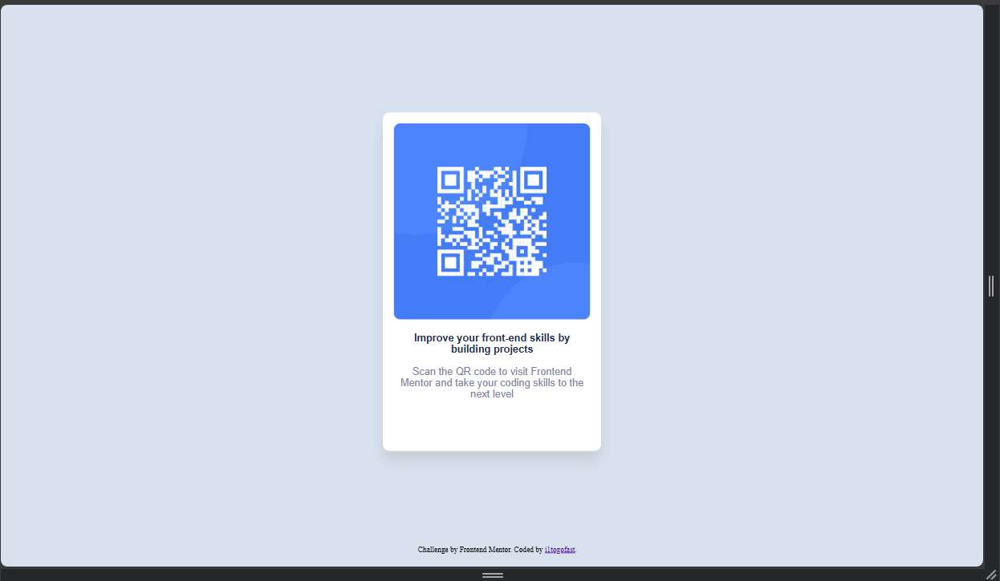
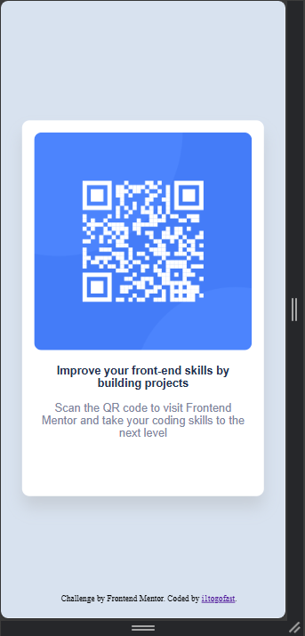

# Frontend Mentor - QR code component solution

This is a solution to the [QR code component challenge on Frontend Mentor](https://www.frontendmentor.io/challenges/qr-code-component-iux_sIO_H). Frontend Mentor challenges help you improve your coding skills by building realistic projects. 

## Table of contents

- [Overview](#overview)
  - [Screenshot](#screenshot)
  - [Links](#links)
- [My process](#my-process)
  - [Built with](#built-with)
  - [What I learned](#what-i-learned)
  - [Continued development](#continued-development)
- [Author](#author)

## Overview

  ### Screenshot

   

  ### Links

  - Solution URL: [Add solution URL here]()
  - Live Site URL: [Add live site URL here]()

## My process
  Adding the core HTML elements were super easy, I just dont have a lot opf practice with CSS and most if it is old and rusty, so I was banging my head against the wall on a couple things.

  ### Built with

    - Semantic HTML5 markup
    - CSS custom properties

  ### What I learned

    Setting the .attributions class to 100% width allowed me to center the text in the middle of the screen

  ### Continued development

    I need more work in CSS and the up to date way of the way things work

## Author

- Frontend Mentor - [@i1togofast](https://www.frontendmentor.io/profile/i1togofast)

*
